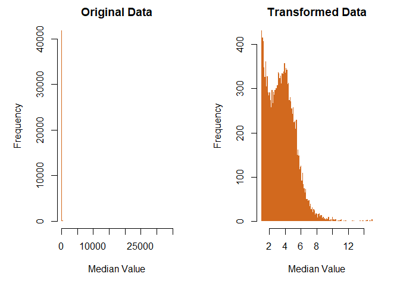
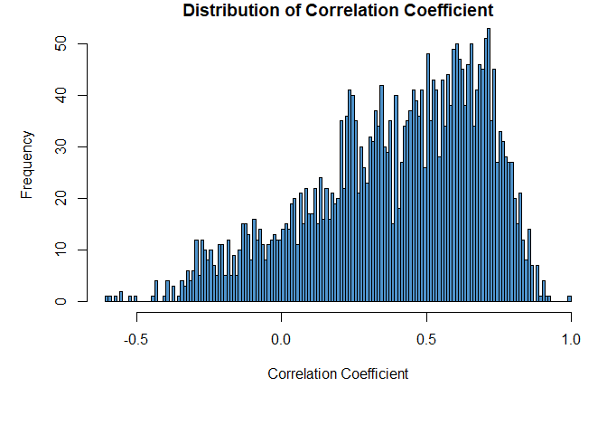
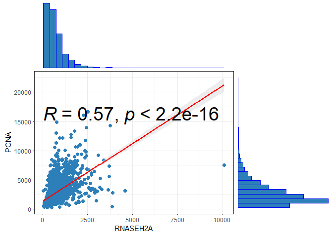
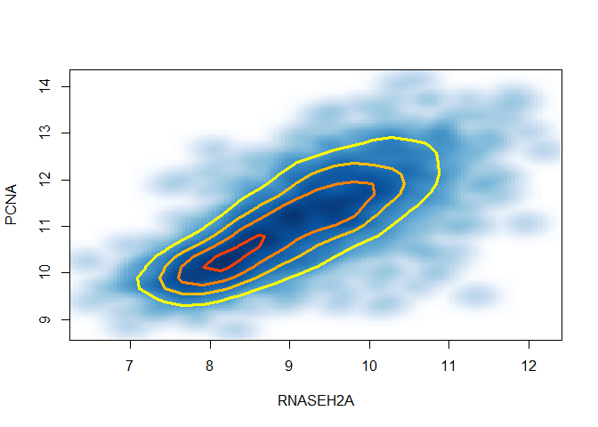
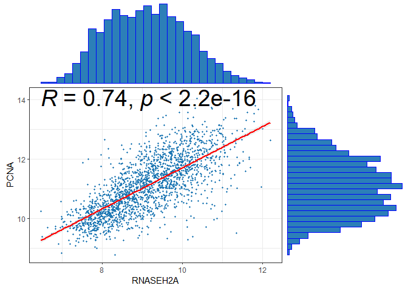
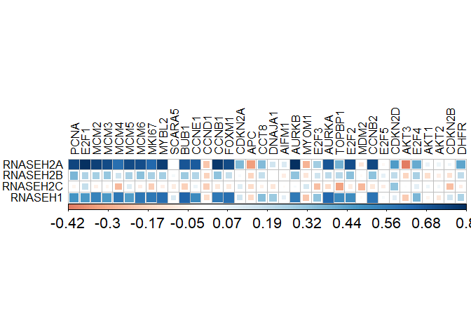

<!-- README.md is generated from README.Rmd. Please edit that file -->

# FeatureCorr

<!-- badges: start -->

[](https://github.com/DKundnani/FeatureCorr/actions/workflows/check-standard.yaml)
[](https://codeocean.com/capsule/7549295/tree)
<!-- badges: end -->

An R package to study feature correlations aided with data
transformation for Next Generation sequencing and microarray data

## Installation

The development version from [GitHub](https://github.com/) with:

``` r
# install.packages("devtools")
devtools::install_github("DKundnani/FeatureCorr")
```

## Example

Following is an example of function usage by utilizing sample data
provided in the package. It contains Gene-Tissue Expression dataset with
\~8000 genes(features) expression in 53 tissues, sampled from a larger
dataset containing \>42K genes.

Another dataset is from The Cancer Genome Atlas Pan Cancer dataset
randomly selected 2000 samples from \>10K samples, with information for
selected 40 features(genes)

``` r
library(FeatureCorr) #Loading the library
```

Data Transformation using FeatureCorr::data_transform function

``` r
#Data Transformation
transdf<- data_transform(df=GTEX[-1],transformation='log2', featurelist=GTEX$Description, medianthres=1)
```

 Data
Transformation using FeatureCorr::data_transform function Prime Feature
Correlation using FeatureCorr::primefeature_corr function

``` r
# Prime Feature(RNASEH2A gene) Correlation in Gene-Tissue EXpression Dataset
inputdf<-transdf[[1]] #First item in the list returned is the transformed Data
primefcorr <- primefeature_corr(df=inputdf,featurelist=rownames(inputdf) ,primefeature="RNASEH2A")
#> Calculating Correlation Coefficients
#> Calculating Distribution Statistics
#> Plotting Correlation Coefficient Distribution
```



Visualizing Single Pair Correlation using using
FeatureCorr::pair_scatter function

``` r
#Single Pair Scatter on Original RNA-seq Dataset vs log2 transformed RNA-seq Dataset
pair_scatter(df=TCGA40,featurelist=rownames(TCGA40),feature1="RNASEH2A",feature2="PCNA", corrmeth='pearson')[[1]]
#> `geom_smooth()` using formula 'y ~ x'
#> `geom_smooth()` using formula 'y ~ x'
```



``` r
pair_scatter(df=logTCGA40,featurelist=rownames(logTCGA40),feature1="RNASEH2A", feature2="PCNA", corrmeth='pearson')[[1]]
#> `geom_smooth()` using formula 'y ~ x'
#> `geom_smooth()` using formula 'y ~ x'
```



Visualizing Multiple Pair-wise Correlation using
FeatureCorr::pairwise_corr function

``` r
#Multiple pairwise correlation for 40 genes in ~10K samples in The Cancer Genome Atlas-Pan Cancer dataset
corr_pair<-pairwise_corr(df=logTCGA40,featurelist=rownames(logTCGA40), visorder="hclust", clustno=2)
```


``` r
# Separating feature of interest for visualization 
# In This technique you can group features of differen types. For example if I have methylation and transcription data in the same dataframe for same set of feature identfiers
featgroup<-grepl( "RNASE",rownames(logTCGA40)) #optional, a set of features to separated
corr_pair<-pairwisecorr <- pairwise_corr(df=logTCGA40,featurelist=rownames(logTCGA40),featuregroup=featgroup)
```


